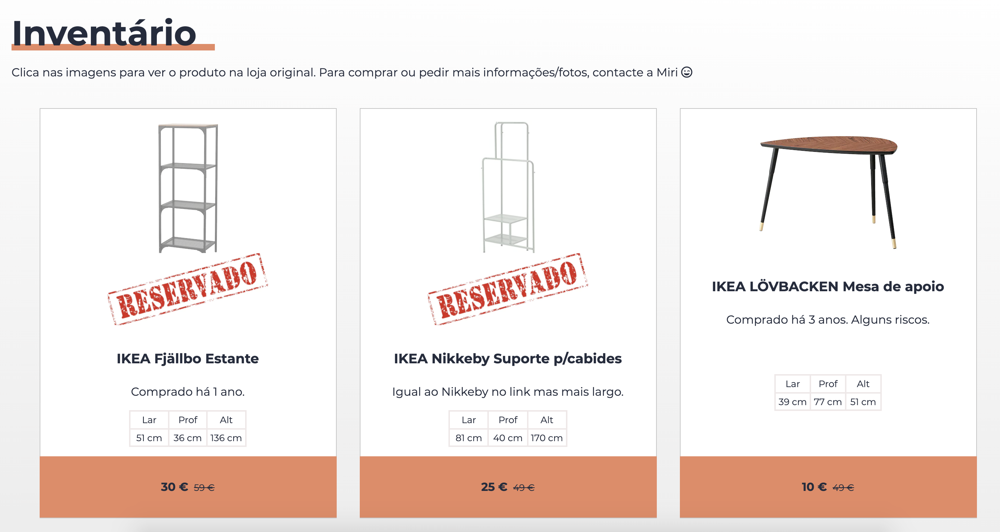

# House Inventory

We are moving to Amsterdam! This website was created to show and share items we want to sell or give away before moving.

## Table of contents

- [Overview](#overview)
  - [Screenshot](#screenshot)
  - [Links](#links)
- [Built with](#built-with)
- [Author](#author)

## Overview

Users should be able to:

- See hover states for interactive elements
- View the optimal layout for the component depending on their device's screen size
- Navigate to external website to get more information about the specific item
- See if the item is still available or already reserved

### Screenshot

### Links

- [Live Site URL](https://miri52.github.io/inventory/)

## Built with

CSS:

- Mobile-first workflow
- Grid
- Flexbox
- Media queries

JS:

- fetch("data.json")
- async/await

## Author

- LinkedIn - [Miriama Svítková](https://www.linkedin.com/in/miriama-svitkova)
